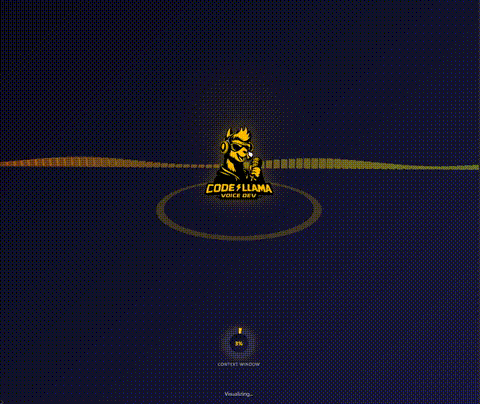

# VoiceLLAMA

<p align="center">
  
</p>

<p align="center">
  <strong>Ultra-fast Text-to-Speech API Server</strong><br>
  Turn text into natural speech with a simple command
</p>

<p align="center">
  <a href="#installation">Installation</a> •
  <a href="#quick-start">Quick Start</a> •
  <a href="#claude-code-integration">Claude Code</a> •
  <a href="#api-reference">API</a> •
  <a href="#configuration">Config</a> •
  <a href="#uninstall">Uninstall</a>
</p>

---

## What is VoiceLLAMA?

VoiceLLAMA is a ready-to-use TTS (Text-to-Speech) API server that lets you generate natural-sounding speech from text. Just install, run one command, and you have a full-featured TTS API running locally.

**Key Features:**
- 9 high-quality voices (American & British, Male & Female)
- REST API with WebSocket streaming support
- Built-in web UI for testing and configuration
- Response caching for instant repeated requests
- Cross-platform: Windows, Linux, macOS

## Installation

### 1. Install VoiceLLAMA

```bash
pip install voicellama
```

This automatically installs all Python dependencies including the [Kokoro](https://github.com/hexgrad/kokoro) TTS engine.

### 2. Install espeak-ng (Required)

VoiceLLAMA requires **espeak-ng** for phoneme conversion. Install it for your platform:

| Platform | Command |
|----------|---------|
| **Windows** | Download installer from [espeak-ng releases](https://github.com/espeak-ng/espeak-ng/releases) |
| **Linux (Debian/Ubuntu)** | `sudo apt-get install espeak-ng` |
| **macOS** | `brew install espeak-ng` |

### 3. Verify Installation

```bash
voicellama --version
```

## Quick Start

```bash
# Start the server
voicellama serve

# That's it! Open your browser to:
# http://localhost:8333      - Web UI
# http://localhost:8333/docs - API Documentation
```

### Generate Speech

```bash
curl -X POST http://localhost:8333/tts/announce \
  -H "Content-Type: application/json" \
  -d '{"text": "Hello from VoiceLLAMA!", "voice": "af_heart"}' \
  --output speech.wav
```

### Python Example

```python
import requests

response = requests.post(
    "http://localhost:8333/tts/announce",
    json={"text": "Hello from VoiceLLAMA!", "voice": "af_heart"}
)

with open("speech.wav", "wb") as f:
    f.write(response.content)
```

## Claude Code Integration

VoiceLLAMA includes hooks for [Claude Code](https://claude.com/claude-code) that make Claude speak responses aloud.

### Setup Hooks

Add to your `~/.claude/settings.json`:

```json
{
  "hooks": {
    "PreToolUse": [
      {
        "matcher": "AskUserQuestion",
        "hooks": [{"type": "command", "command": "python -m voicellama.hooks.tts_notify"}]
      },
      {
        "matcher": ".*",
        "hooks": [{"type": "command", "command": "python -m voicellama.hooks.tts_tool_notify"}]
      }
    ],
    "PostToolUse": [
      {
        "matcher": ".*",
        "hooks": [{"type": "command", "command": "python -m voicellama.hooks.context_tracker"}]
      }
    ],
    "Stop": [
      {
        "matcher": ".*",
        "hooks": [{"type": "command", "command": "python -m voicellama.hooks.tts_stop_notify"}]
      }
    ]
  }
}
```

### Chatter Levels

Control how much Claude speaks via the web UI at `http://localhost:8333`:

| Level | What's Announced |
|-------|------------------|
| **sparse** | Only questions that need your input |
| **summary** | Questions + task completion summaries |
| **verbose** | Everything including tool usage |

### Manual Announcements

```bash
# Announce with default settings
python -m voicellama.hooks.announce "Hello world"

# Specify message type
python -m voicellama.hooks.announce "Task complete" summary
```

## Available Voices

| Voice ID | Description |
|----------|-------------|
| `af_heart` | American Female - Warm, expressive **(default)** |
| `af_bella` | American Female - Bella |
| `af_sarah` | American Female - Sarah |
| `am_adam` | American Male - Adam |
| `am_michael` | American Male - Michael |
| `bf_emma` | British Female - Emma |
| `bf_isabella` | British Female - Isabella |
| `bm_george` | British Male - George |
| `bm_lewis` | British Male - Lewis |

## API Reference

| Endpoint | Method | Description |
|----------|--------|-------------|
| `/tts/announce` | POST | Generate speech from text |
| `/tts/batch` | POST | Generate multiple audio files |
| `/voices` | GET | List available voices |
| `/health` | GET | Server health check |
| `/settings` | GET/POST | View/update settings |
| `/metrics` | GET | Prometheus metrics |
| `/docs` | GET | Interactive API docs |

## Configuration

### Command Line Options

```bash
voicellama serve                     # Default (port 8333)
voicellama serve --port 9000         # Custom port
voicellama serve --host 127.0.0.1    # Localhost only
voicellama serve --log-level DEBUG   # Verbose logging
voicellama serve --config my.toml    # Custom config file
```

### Config File (voicellama.toml)

```toml
[server]
port = 8333
host = "0.0.0.0"
log_level = "INFO"

[tts]
default_voice = "af_heart"
default_speed = 1.0
cache_enabled = true
```

### Environment Variables

```bash
export PORT=8333
export LOG_LEVEL=DEBUG
export CORS_ALLOW_ALL=true
voicellama serve
```

## Uninstall

### Remove VoiceLLAMA only
```bash
pip uninstall voicellama
```

### Remove VoiceLLAMA and dependencies
```bash
pip uninstall voicellama kokoro torch transformers fastapi uvicorn soundfile
```

### Remove espeak-ng

| Platform | Command |
|----------|---------|
| **Windows** | Uninstall via Settings > Apps |
| **Linux** | `sudo apt-get remove espeak-ng` |
| **macOS** | `brew uninstall espeak-ng` |

## Platform Notes

### macOS Apple Silicon
Enable GPU acceleration:
```bash
PYTORCH_ENABLE_MPS_FALLBACK=1 voicellama serve
```

### Audio Format Support
- **WAV** - Always available
- **MP3/OGG** - Requires [ffmpeg](https://ffmpeg.org/) installed

## Development

```bash
# Clone and install in development mode
git clone https://github.com/miskaone/VoiceLLAMA.git
cd VoiceLLAMA
pip install -e .

# Run tests
pytest

# Run with auto-reload
uvicorn voicellama.server:create_app --factory --reload --port 8333
```

## Dependencies

VoiceLLAMA is built on these excellent projects:
- [Kokoro](https://github.com/hexgrad/kokoro) - TTS model (82M parameters)
- [FastAPI](https://fastapi.tiangolo.com/) - Web framework
- [espeak-ng](https://github.com/espeak-ng/espeak-ng) - Phoneme conversion

## License

Apache 2.0 - See [LICENSE](LICENSE) for details.

Copyright 2024 FlowEvolve
